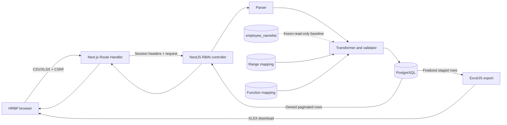
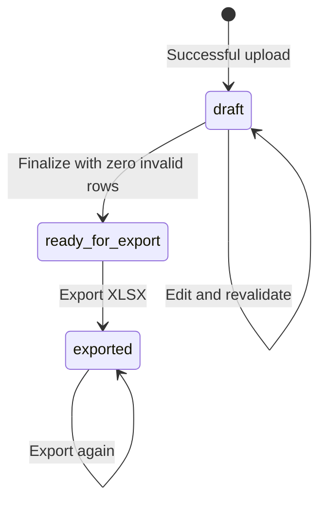

# RBIN Namelist to PS Namelist

## Purpose

RBIN Namelist to PS Namelist is an HRBP-only data-cleaning workflow. It accepts
one mixed Active, Inbound, and Outbound RBIN file, retains the complete raw
source snapshot, selects PS employees, derives Range and Function, compares the
result with the current employee namelist, supports permanent staged review and
editing, and exports a cleaned 29-column XLSX workbook.

This workflow does **not** update `public.employee_namelist`. That table is read
only and is used solely as the comparison baseline. Monthly replacement of the
live employee namelist remains the responsibility of Namelist Updation.

## Completed capability

- Accepts CSV and modern XLSX files up to 50 MB.
- Accepts up to 25,000 non-empty data rows.
- Processes Active, Inbound, and Outbound employees from one file.
- Requires the complete 28-field raw RBIN schema in any column order.
- Retains every uploaded raw row, including excluded, malformed, and duplicate rows.
- Stages only rows whose trimmed, case-insensitive `Organisational Area(PA)` is `PS`.
- Drops `Other Designation` from the transformed dataset.
- Derives Range and Function independently from Organizational Unit mappings.
- Requires both Range and Function for every staged employee, including Outbound.
- Shows missing mappings as summary alerts and cell-level validation issues.
- Compares staged rows by `pers_no` with a frozen `employee_namelist` baseline.
- Classifies rows as New, Changed, or Unchanged and retains previous values.
- Allows complete staged rows to be edited while the batch is a draft.
- Revalidates the whole batch after an edit so duplicate detection remains correct.
- Retains staging batches permanently and lists them under Saved datasets.
- Supports server-side filters, search, pagination, and 25/50/100 rows per page.
- Finalizes only batches with zero invalid rows.
- Produces an ordered 29-column XLSX workbook and audits every export.
- Restricts all data to the authenticated HRBP account that uploaded it.

## Architecture



The browser never calls NestJS directly. Client requests go to same-origin
Next.js Route Handlers, which attach the authenticated server session and
forward the request to the API. Mutating browser requests also carry the
existing session-bound CSRF token.

## Packages and platform components

No RBIN-specific package is required in the web application. The feature uses
packages already declared by the API and web projects.

| Package or component | Purpose |
| --- | --- |
| `@nestjs/common` | Controller, service, validation exceptions, streaming response, and dependency injection. |
| `@nestjs/platform-express` | Multer-backed multipart `FileInterceptor` with a 50 MB limit. |
| `csv-parse` | Synchronous CSV parsing with quoted-field and UTF-8 BOM support. |
| `exceljs` | Reads XLSX uploads and generates the final XLSX workbook. |
| `pg` | Parameterized PostgreSQL queries and transactions through `DatabaseService`. |
| Node.js `crypto` | SHA-256 hashes for uploaded files and generated exports. |
| `@types/multer` | Development typing support for multipart infrastructure. |
| Next.js Route Handlers | Authenticated same-origin browser-to-API proxy layer. |
| React | Preview state, editing, filtering, searching, pagination, and download interaction. |
| Bosch Frontend Kit | Existing controls, icons, typography, and visual conventions. |

Install the declared dependencies from the repository root when setting up a
new checkout:

```powershell
npm install --prefix apps/api
npm install --prefix apps/web
```

Do not use `npm audit fix --force` without reviewing its breaking dependency
changes.

## Data model and retention

| Table | Retention | Purpose |
| --- | --- | --- |
| `public.rbin_namelist_imports` | Permanent | Upload audit metadata, file hash, counts, status, owner, and timestamps. |
| `public.rbin_namelist` | Latest snapshot | Complete raw rows from the latest successful upload. A later successful upload replaces this snapshot atomically. |
| `public.org_unit_range_mappings` | Permanent | Case-insensitive Organizational Unit to Range lookup. |
| `public.org_unit_function_mappings` | Permanent | Case-insensitive Organizational Unit to Function lookup. |
| `public.rbin_staging_batches` | Permanent | Account-owned batch state, counts, hashes, and finalization/export timestamps. |
| `public.rbin_staging_rows` | Permanent | Original transformed values, current edited values, issues, baseline, changed columns, and mapping sources. |
| `public.rbin_staging_exports` | Permanent | Export actor, timestamp, file name, row count, and SHA-256 file hash. |
| `public.employee_namelist` | Never written | Read-only source for comparison baselines. |

Raw rows use `(import_id, source_row_number)` rather than `pers_no` as their
identity. This allows the raw snapshot to preserve blank, invalid, and duplicate
employee numbers. `raw_source_data` is authoritative JSONB; nullable typed
columns support querying values that can be safely cast.

Staging rows use `(batch_id, source_row_number)`. They retain both
`original_data` and editable `current_data`. They are not expired or deleted by
this workflow.

## Database setup

### Fresh database

Apply `apps/sql/rbin_namelist_creation.sql` after authentication and the live
namelist schemas exist:

```powershell
$db=((Get-Content apps/api/.env | Where-Object { $_ -match '^\s*DATABASE_URL=' } | Select-Object -First 1) -split '=',2)[1].Trim().Trim('"').Trim("'")
& "C:\Program Files\PostgreSQL\18\bin\psql.exe" --dbname="$db" --set ON_ERROR_STOP=1 --file="apps/sql/rbin_namelist_creation.sql"
```

### Existing preliminary RBIN database

Back up the database, then apply the forward migration once:

```powershell
$db=((Get-Content apps/api/.env | Where-Object { $_ -match '^\s*DATABASE_URL=' } | Select-Object -First 1) -split '=',2)[1].Trim().Trim('"').Trim("'")
& "C:\Program Files\PostgreSQL\18\bin\psql.exe" --dbname="$db" --set ON_ERROR_STOP=1 --file="apps/sql/rbin_cleaning_migration.sql"
```

Do not run the fresh creation script against a database that already contains
preliminary RBIN tables. The migration is transactional and stops when legacy
ownership cannot be resolved safely.

## Mapping setup

Range and Function are intentionally separate mappings. One may resolve while
the other remains missing.

Preferred loader:

```powershell
& .\infra\scripts\load-rbin-mappings.ps1
```

Override the source files when needed:

```powershell
& .\infra\scripts\load-rbin-mappings.ps1 `
  -FunctionCsv "C:\path\OrgUnit Function Mapping.csv" `
  -RangeCsv "C:\path\OrgUnit - Range Mapping.csv"
```

The loader:

1. Reads `DATABASE_URL` from `apps/api/.env` unless `-DatabaseUrl` is supplied.
2. Locates `psql`, using PostgreSQL 18's default Windows path unless overridden.
3. Validates both CSVs before changing PostgreSQL.
4. Rejects blank Organizational Units or mapped values.
5. Rejects conflicting duplicate Organizational Unit mappings.
6. Creates or migrates the RBIN schema when required.
7. Transactionally upserts Range and Function mappings.
8. Prints the final mapping counts.

Accepted Organizational Unit header variants are `organizational_unit`,
`organisational_unit`, `org_unit`, and `orgunit` after normalization. Range may
be `range` or `range_value`; Function may be `function` or `function_value`.

Mapping keys are matched after trimming and lowercasing. Manual edits in a
staging row do not update either mapping table.

## Source file contract

### Supported formats

- `.csv`
- `.xlsx`

The file must contain a header and at least one non-empty data row. An XLSX file
must contain exactly one non-empty worksheet. Legacy `.xls` files are not
supported.

### Required raw fields

All 28 source fields must be present. Their order may differ.

```text
pers_no
personnel_number
joining_date
pa
personnel_area
employee_group
esgrp
employee_subgroup
psubarea
personnel_subarea
lp
cost_center
organizational_unit
location
organisational_area_pa
gender_key
global_id
ps_group
birth_date
nt_id
designation_text
other_designation
entry_for_retirement
technical_entry_date
official_email
direct_or_indirect
hrbp_global_id
hrbp2_global_id
```

Header matching trims whitespace, ignores case, and replaces punctuation runs
with underscores. Approved business aliases include:

| Uploaded header | Internal field |
| --- | --- |
| `Pers.No.` | `pers_no` |
| `Personnel No` | `personnel_number` |
| `Date of Joinin` or `Date of Joining` | `joining_date` |
| `Cost Ctr` | `cost_center` |
| `Date of Birth` or `Birth date` | `birth_date` |
| `Email Official` | `official_email` |
| `Global-Id of HRBP` | `hrbp_global_id` |
| `Global-Id of HRBP2` | `hrbp2_global_id` |

The approved RBIN export currently labels both final HRBP columns
`Global-Id of HRBP`. When exactly two such headers exist and no explicit HRBP2
header exists, the parser treats the second occurrence as `hrbp2_global_id`.
Other unknown, missing, or duplicate headers are rejected.

XLSX identifiers beyond JavaScript's safe integer range must be formatted as
text in the source workbook. This prevents Excel or JavaScript from silently
changing identifier digits.

## Transformation contract

The transformation proceeds in this order:

1. Parse every raw row as text and preserve its source row number.
2. Load independent Range and Function mappings.
3. Read matching `employee_namelist` rows by valid `pers_no` for comparison.
4. Keep only rows where trimmed, case-insensitive `organisational_area_pa` is `ps`.
5. Construct the canonical 29-column output object.
6. Exclude `other_designation`.
7. Insert mapped Range and Function values independently.
8. Validate all 29 transformed values.
9. Mark every occurrence of a duplicate staged `pers_no` invalid.
10. Compare each row with its frozen baseline.
11. Persist raw replacement, import audit, permanent batch, and staging rows in one transaction.

A failed transaction preserves the previous raw snapshot and does not leave a
partial staging batch.

### Output columns

The generated PS dataset contains these columns in this exact order:

```text
Pers.No.
Personnel Number
Employee Group
LP
ESgrp
Employee Subgroup
PS group
Organizational Unit
Range
Function
Organisational Area(PA)
Gender Key
Location
PA
Personnel Area
PSubarea
Personnel Subarea
NT_ID
Global ID
Cost Ctr
Birth date
Date of Joining
Entry for Retirement
Designation Text
Global-Id of HRBP
Global-Id of HRBP2
Email Official
Technical Entry Date
Direct or Indirect
```

## Validation rules

- Every transformed output field is required, including Range and Function for Outbound employees.
- `pers_no`, `global_id`, and `hrbp_global_id` must be positive whole numbers no greater than PostgreSQL `BIGINT` maximum.
- `birth_date`, `joining_date`, `entry_for_retirement`, and `technical_entry_date` must be real `YYYY-MM-DD` dates.
- `official_email` must have a valid email shape.
- Every duplicate staged `pers_no` occurrence is invalid.
- A missing Range or Function produces `mapping_not_found` on the affected cell.
- A missing non-mapping value produces `required`.
- Invalid numeric, date, or email content produces `invalid`.
- Duplicate employee numbers produce `duplicate` on `pers_no`.

Finalization is blocked while `invalidRows` is greater than zero.

## Comparison behavior

Comparison uses `pers_no` as the key and all 29 output fields as the value set.
The matching `employee_namelist` row is serialized and stored in
`baseline_employee_data` when the batch is created.

| Status | Meaning |
| --- | --- |
| `new` | No live `employee_namelist` row existed for the staged `pers_no`. |
| `changed` | A baseline existed and one or more trimmed output values differ. |
| `unchanged` | A baseline existed and every trimmed output value matches. |

Changed rows store `changed_columns`, and the UI displays the previous baseline
value. Because the baseline is stored in staging, later changes to
`employee_namelist` do not rewrite an existing batch's comparison history.
When a draft edit changes `pers_no`, the API obtains the baseline for the new
employee number before revalidating the batch.

## Batch lifecycle



- `draft`: editable and not exportable.
- `ready_for_export`: finalized, no longer editable, and exportable.
- `exported`: exportable again; each download creates another audit record.

Finalization does not write to `employee_namelist`. There is no automatic batch
expiry or deletion.

## API contract

NestJS prefix: `/api/v1/hrbp-point/rbin-cleaning`

| Method and path | Permission | Behavior |
| --- | --- | --- |
| `POST /batches` | `namelist:transform` | Accept multipart field `file`, parse, transform, and persist a draft batch. |
| `GET /batches` | `namelist:transform` | List retained batches owned by the authenticated account, newest first. |
| `GET /batches/:batchId/rows` | `namelist:transform` | Return an owned batch summary and searched, filtered, paginated rows. |
| `PATCH /batches/:batchId/rows/:rowNumber` | `namelist:transform` | Replace one complete 29-field draft row and revalidate the complete batch. |
| `POST /batches/:batchId/finalize` | `namelist:transform` | Finalize a valid draft for export. |
| `POST /batches/:batchId/export` | `namelist:transform`, `namelist:export` | Generate, audit, and stream an XLSX file. |

### Row query parameters

| Parameter | Values | Default |
| --- | --- | --- |
| `filter` | `all`, `valid`, `invalid`, `new`, `changed`, `unchanged` | `all` |
| `search` | Up to 100 characters; case-insensitive substring of `pers_no` or `personnel_number` | Empty |
| `page` | Positive integer | `1` |
| `pageSize` | Positive integer, maximum `100` | `25` at API level; UI sends `50` by default |

Search and filter are applied before pagination. The returned `filteredRows`
count uses the same predicates as the row query.

The PATCH body must contain exactly the 29 output keys, each as text. The API
trims every value before validation.

## Web application behavior

The HRBP Point panel provides:

- Mixed employee file selection and upload.
- Raw, PS staged, excluded, valid, invalid, New, Changed, and Unchanged counts.
- A collapsed-by-default Saved datasets section with the retained batch count.
- Missing-mapping alerts grouped by Organizational Unit.
- All, Valid, Invalid, New, Changed, and Unchanged filters.
- Server-side search by Pers.No. or Personnel Number.
- 25, 50, or 100 rows per page, defaulting to 50.
- A Review fields view containing:
  - Pers.No.
  - Personnel Number
  - Employee Group
  - PS Group
  - Organizational Unit
  - Range
  - Function
  - Location
  - Direct or Indirect
- An All 29 fields view.
- Cell-level issue and changed-value highlighting.
- A focused side editor for draft rows.
- Finalization and real XLSX browser download.

The grid is the preview dialog's primary vertical scroll region so headers,
filters, pagination, and actions remain available.

## Security and integrity

- The controller requires `namelist:transform`; export additionally requires `namelist:export`.
- Only the HRBP role currently receives these permissions.
- Backend permission checks are authoritative; UI visibility is not a security boundary.
- Mutating browser requests require the existing session-bound CSRF token.
- Next.js obtains the authenticated session headers server-side and does not expose them to browser code.
- Batch reads, edits, finalization, and exports include `uploaded_by` ownership checks.
- Database writes use parameterized SQL.
- Upload replacement and staging creation run in one PostgreSQL transaction.
- Draft edits lock the owned batch and update validation/comparison counts transactionally.
- Finalization locks the owned draft and rechecks invalid row counts.
- Export locks an exportable owned batch before recording its SHA-256 audit hash.
- Source and generated file hashes are SHA-256 values.
- The proxy disables response caching and uses a 60-second upstream timeout.
- RBIN cleaning never inserts, updates, or deletes `employee_namelist` rows.

## Error behavior

| Condition | Result |
| --- | --- |
| Missing file, unsupported format, bad headers, bad pagination, or oversized search | `400 Bad Request` |
| File over 50 MB or more than 25,000 rows | `413 Payload Too Large` |
| Missing or expired authentication | Existing authentication response, normally `401` |
| Missing permission | Existing authorization response, normally `403` |
| Batch not found or not owned | `404 Not Found` |
| Editing a non-draft batch | `409 Conflict` |
| Finalizing with invalid rows | `409 Conflict` |
| Exporting before finalization | `409 Conflict` |
| Unexpected parser/database/export failure | Safe public `500` message; internal details remain server-side |

## File responsibilities

### Database and operations

| File | Responsibility |
| --- | --- |
| `apps/sql/rbin_namelist_creation.sql` | Fresh-install audit, raw, mapping, staging, and export schema. |
| `apps/sql/rbin_cleaning_migration.sql` | Transactional forward migration from the preliminary RBIN schema. |
| `apps/sql/README.md` | Database application order, retention contract, and manual mapping SQL. |
| `infra/scripts/load-rbin-mappings.ps1` | Validates, creates/migrates, and transactionally upserts both mapping files. |

### API

| File | Responsibility |
| --- | --- |
| `apps/api/src/modules/hrbp-point/rbin-cleaning/rbin-cleaning.types.ts` | Raw schema and API/domain types. |
| `apps/api/src/modules/hrbp-point/rbin-cleaning/rbin-cleaning.parser.ts` | CSV/XLSX parsing, header mapping, worksheet/row limits, and text preservation. |
| `apps/api/src/modules/hrbp-point/rbin-cleaning/rbin-cleaning.transformer.ts` | PS selection, mappings, 29-column transformation, validation, duplicates, and comparison. |
| `apps/api/src/modules/hrbp-point/rbin-cleaning/rbin-cleaning.repository.ts` | Transactions, ownership-scoped persistence, search/filter/paging, finalization, and export audit. |
| `apps/api/src/modules/hrbp-point/rbin-cleaning/rbin-cleaning.service.ts` | Workflow orchestration, input validation, full-batch revalidation, and XLSX generation. |
| `apps/api/src/modules/hrbp-point/rbin-cleaning/rbin-cleaning.controller.ts` | Multipart, JSON, query, finalize, and streamed-export endpoints. |
| `apps/api/src/modules/hrbp-point/rbin-cleaning/rbin-cleaning.spec.ts` | Focused parser and transformation regression tests. |
| `apps/api/src/common/authorization/permissions.ts` | `namelist:transform` and `namelist:export` declarations and role grants. |
| `apps/api/src/modules/hrbp-point/hrbp-point.module.ts` | Controller, service, and repository registration. |

### Web

| File | Responsibility |
| --- | --- |
| `apps/web/src/features/hrbp-point/RbinNamelistCleaningPanel.tsx` | Upload, saved batches, preview, alerts, search, filters, paging, editing, finalize, and export UI. |
| `apps/web/src/features/hrbp-point/rbin-cleaning.types.ts` | Browser-side API and view model contract. |
| `apps/web/src/features/hrbp-point/rbin-cleaning.http.ts` | Browser HTTP client, CSRF propagation, and XLSX download. |
| `apps/web/src/features/hrbp-point/rbin-cleaning.api.ts` | Server-only authenticated NestJS forwarding and error translation. |
| `apps/web/src/features/hrbp-point/hrbp-point.css` | Responsive RBIN panel, dialog, alert, grid, editor, search, and pagination styles. |
| `apps/web/app/api/hrbp-point/rbin-cleaning/batches/route.ts` | Batch list and multipart upload proxy. |
| `apps/web/app/api/hrbp-point/rbin-cleaning/batches/[batchId]/rows/route.ts` | Search/filter/pagination proxy. |
| `apps/web/app/api/hrbp-point/rbin-cleaning/batches/[batchId]/rows/[rowNumber]/route.ts` | Draft row edit proxy. |
| `apps/web/app/api/hrbp-point/rbin-cleaning/batches/[batchId]/finalize/route.ts` | Finalization proxy. |
| `apps/web/app/api/hrbp-point/rbin-cleaning/batches/[batchId]/export/route.ts` | Binary XLSX export proxy preserving content headers. |

## Verification

Run the focused checks from the repository root:

```powershell
npm test --prefix apps/api -- rbin-cleaning.spec.ts
npm run build --prefix apps/api
npm run build --prefix apps/web
```

End-to-end smoke test:

1. Sign in as an HRBP.
2. Upload one mixed Active/Inbound/Outbound CSV or XLSX file.
3. Confirm raw, PS staged, and excluded counts.
4. Confirm missing Range/Function mappings appear in the alert and affected cells.
5. Search by Pers.No. and Personnel Number.
6. Exercise filters, page navigation, and 25/50/100 page sizes.
7. Edit invalid draft rows until `invalidRows` reaches zero.
8. Confirm previous values and New/Changed/Unchanged statuses are credible.
9. Finalize the cleaned dataset.
10. Export the XLSX and confirm it contains 29 ordered columns.
11. Confirm the finalized batch is retained and can be exported again.
12. Confirm `employee_namelist` was not modified.

Useful database checks:

```sql
SELECT id, file_name, total_rows, ps_rows, excluded_rows, valid_rows,
       invalid_rows, status, uploaded_by, created_at, completed_at
FROM public.rbin_namelist_imports
ORDER BY created_at DESC
LIMIT 10;

SELECT COUNT(*) AS latest_raw_rows
FROM public.rbin_namelist;

SELECT batch_id, file_name, status, total_raw_rows, staged_rows, excluded_rows,
       valid_rows, invalid_rows, new_rows, changed_rows, unchanged_rows,
       created_at, finalized_at, first_exported_at, last_exported_at
FROM public.rbin_staging_batches
ORDER BY created_at DESC
LIMIT 10;

SELECT batch_id, exported_by, exported_at, file_name, row_count, file_hash
FROM public.rbin_staging_exports
ORDER BY exported_at DESC
LIMIT 10;
```

To prove the cleaning workflow does not replace the live namelist, record this
value before upload and compare it after finalization/export:

```sql
SELECT COUNT(*) FROM public.employee_namelist;
```

## Troubleshooting

### Missing HRBP2 and duplicate HRBP header

The approved RBIN export may label both final columns `Global-Id of HRBP`. This
is supported when there are exactly two occurrences and no explicit HRBP2
header. Restart the API after deploying parser changes.

### Missing mapping alert

Load or correct the Organizational Unit mapping files with
`load-rbin-mappings.ps1`, then upload a new file to apply those mappings to a
new batch. Existing staged rows retain their original mapped values; they may be
corrected manually while still draft.

### Finalize button remains unavailable

Inspect Invalid rows and the missing-mapping alert. Every one of the 29 output
fields must be valid. Function is required for Outbound employees in this
workflow.

### Batch cannot be edited

Only `draft` batches are editable. `ready_for_export` and `exported` batches are
permanent snapshots and can only be viewed or exported.

### Export is rejected

Finalize the draft first. Export is allowed only for `ready_for_export` or
`exported` batches and requires `namelist:export`.

### Identifier digits change in XLSX

Format `pers_no`, `global_id`, and `hrbp_global_id` as text in the source
workbook. CSV is also safe for textual identifiers. The generated workbook
formats identifier columns, including HRBP2, as text.

### Search returns fewer rows than expected

Search targets only `pers_no` and `personnel_number`, as those are the available
requested identifiers. It combines with the active validity/comparison filter
before pagination.
