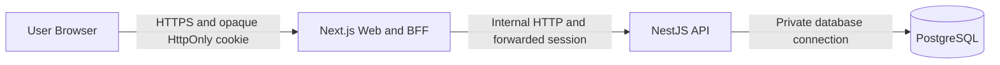
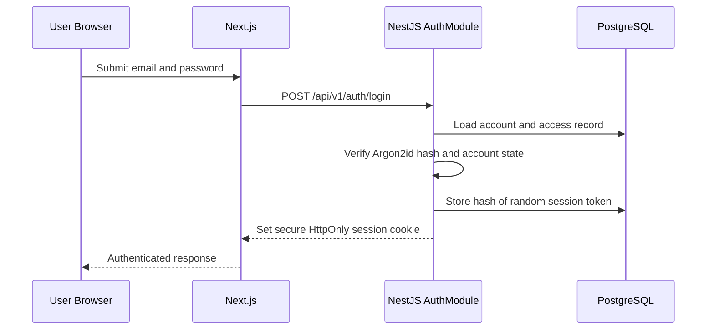
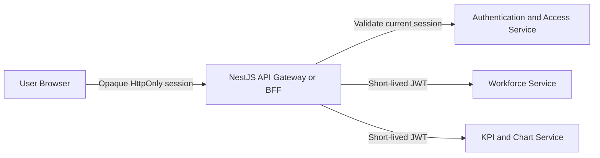

# Security Architecture

**Status:** Approved direction for implementation  
**Version:** 1.0  
**Initial scope:** HRBP and Admin authentication and authorization  
**Future scope:** Head-role data scoping and service decomposition

## 1. Purpose

This document records the security architecture selected for PS Dashboard, the reasons for the decision, the alternatives considered, and the controls required during implementation.

The application processes employee information. Authentication and authorization must therefore be enforced by the server and database access layer, not only by page visibility or disabled frontend controls.

## 2. Decision Summary

PS Dashboard will use:

- Email address as the local login identifier.
- A UUID as the internal account identifier, with an optional unique `pers_no`
    link for accounts represented in the employee namelist.
- Argon2id password hashing.
- Opaque, database-backed browser sessions.
- Secure HttpOnly cookies for browser session transport.
- PostgreSQL for account, access, session, and security audit records.
- A fixed, version-controlled role and permission matrix for the first release.
- NestJS as the authoritative authentication and authorization boundary.
- Next.js route protection and UI permissions only as additional user-experience controls.

The browser will not receive a long-lived JWT. If the backend is later divided into multiple services, the NestJS gateway will exchange a validated browser session for short-lived, audience-specific internal JWTs.

## 3. Security Objectives

The architecture must:

1. Verify the identity of every user before employee data is returned.
2. Enforce permissions on every protected API request.
3. Support immediate account deactivation and session revocation.
4. Support logout from one browser without necessarily ending other sessions.
5. Require users to replace temporary passwords after initial login or reset.
6. Prevent the browser from selecting or modifying its trusted role and scope.
7. Record security-sensitive account operations without recording secrets.
8. Prevent authenticated responses from leaking through shared caches.
9. Provide a clear path to scoped Head access and multiple backend services.

## 4. Initial Authorization Model

The first milestone supports only HRBP and Admin accounts.

| Capability | HRBP | Admin |
| --- | ---: | ---: |
| Log in | Yes | Yes |
| View workforce pages | Yes | Yes |
| View all workforce data | Yes | Yes |
| Access Point | Yes | No |
| HRBP Point | Yes | No |
| Create and manage accounts | Yes | No |
| Edit workforce data | Yes | No |
| Application-provided download/export | Yes | No |

Both roles have enterprise-wide employee visibility in the initial milestone. Admin may use normal dashboard filters; unrestricted access means there is no authorization-imposed Range or Organizational Unit restriction.

Permissions are fixed in code for the first release. The Access Point manages accounts and role assignment but does not edit the permission matrix.

## 5. System Boundaries

The responsibilities are separated as follows:

- **Browser:** submits credentials, holds the protected session cookie, and renders only permitted controls.
- **Next.js:** provides pages, same-origin route handlers, optimistic redirects, and safe cookie forwarding.
- **NestJS:** verifies credentials and sessions, loads current access, checks permissions, and authorizes every API operation.
- **PostgreSQL:** stores password hashes, access assignments, session records, audit records, and workforce data.

Next.js Proxy and hidden UI controls are not security authorities. Direct API calls must produce the same authorization result as requests made through the user interface.

## 6. Authentication Flow

### 6.1 Initial account creation

The first HRBP and Admin accounts are created through a one-time, non-public backend seed command:

1. Generate the account UUID.
2. Accept and normalize the login email and display name.
3. Optionally verify and link `pers_no` when the account exists in
    `employee_namelist`; an external HRBP may leave it null.
4. Hash the temporary password with Argon2id.
5. Create the account and access records in one transaction.
6. Set `must_change_password` to true.
7. Record the account creation in the security audit log.

Plaintext passwords must not be placed in SQL files, committed configuration, logs, or audit records.

After bootstrap, an HRBP creates and manages additional accounts through Access Point.

### 6.2 Login

The raw session token exists only in the browser cookie. PostgreSQL stores a SHA-256 hash of the token. A database disclosure therefore does not directly expose reusable browser session tokens.

Login failures use a generic response so callers cannot reliably distinguish an unknown account from an incorrect password. Repeated failures trigger a temporary account lock.

### 6.3 Authenticated request

For every protected request, NestJS:

1. Reads the opaque token from the session cookie.
2. Hashes the token and finds the active `auth_sessions` row.
3. Checks session expiry and revocation state.
4. Loads the current account and role from PostgreSQL.
5. Confirms that the account remains active.
6. Enforces forced-password-change restrictions.
7. Checks the required permission for the endpoint.
8. Executes only the authorized operation.

Role, permissions, and future employee scope are never accepted from browser request fields.

## 7. Session Design

The session cookie contains only a cryptographically random opaque token. It does not contain the user's role, permissions, employee scope, password state, or personal details.

The production cookie must use:

- Name prefixed with `__Host-`.
- `HttpOnly`.
- `Secure`.
- `SameSite=Strict` where deployment behavior permits, otherwise `Lax` with the same CSRF controls.
- `Path=/`.
- No `Domain` attribute.
- An explicit maximum lifetime, initially eight hours.

Session behavior:

- Logout revokes the current session only.
- Password change or reset revokes all other sessions and rotates the current session where applicable.
- Account deactivation revokes every session for that account.
- Role changes revoke every session so new permissions apply immediately.
- Expired and revoked sessions are retained only for the approved audit/operational period and then cleaned up.

## 8. Password Security

Passwords are hashed with Argon2id using reviewed application parameters and a unique random salt. The stored encoded hash includes the algorithm version and parameters required for verification and future upgrades.

Required controls include:

- A minimum password policy appropriate to organizational standards.
- Forced password change after account creation and HRBP reset.
- No plaintext password storage or logging.
- Timing-safe verification through the selected Argon2 implementation.
- Prevention of immediate reuse of the current password.
- Temporary lockout after repeated failed login attempts.
- Rate limiting at the authentication endpoint and reverse-proxy boundary.

## 9. Authorization Enforcement

Authorization follows deny-by-default rules:

- Missing or invalid authentication returns `401 Unauthorized`.
- Valid authentication without the required capability returns `403 Forbidden`.
- Every controller declares or inherits its required permission.
- Services enforce business invariants such as preserving the last active HRBP.
- Repositories receive only trusted authorization context created by NestJS.
- Export and download endpoints require explicit server-side permission even when buttons are hidden.

When authentication is enabled, existing workforce endpoints must no longer remain public. Overview is available to HRBP and Admin. HRBP Point and Access Point are HRBP-only.

The application can disable its own export functions, but it cannot prevent a user who can view information from taking screenshots or manually copying it.

## 10. Security Data Model

Four security tables are used.

### `auth_accounts`

Stores:

- UUID account identity.
- Optional unique `pers_no` employee link.
- Display name and normalized unique login email.
- Argon2id password hash.
- Forced-password-change state.
- Active, inactive, or locked account state.
- Failed login attempts and lock expiry.
- Last login and maintenance timestamps.

### `master_access`

Stores:

- One or more role-and-scope assignments per account.
- One assigned Range per scoped assignment.
- One assigned Organizational Unit per Department Head or Sub-department Head
    assignment. Multiple authorized combinations use multiple assignment rows.
- Creation and update actors and timestamps.

For HRBP and Admin records, assigned Range and Organizational Unit are null.
Unrestricted roles must not be combined with scoped Head assignments on the
same account.

### `auth_sessions`

Stores:

- A hash of the opaque session token.
- Account identity.
- Creation, expiry, last-seen, and revocation timestamps.
- Limited request metadata required for security investigation.

### `security_audit_log`

Stores append-only events for:

- Account creation.
- Login success, failure, and lockout.
- Password change and HRBP reset.
- Role change.
- Activation and deactivation.
- Logout and session revocation.

Audit details must not include passwords, raw session tokens, CSRF secrets, password hashes, or complete employee records.

## 11. Browser Request Protection

Cookie authentication requires protection against cross-site request forgery. State-changing requests must use a CSRF token in a custom header and validate the request `Origin` against the configured allowlist. SameSite cookies are an additional control, not the only CSRF control.

Other browser-facing controls include:

- HTTPS in production.
- Explicit credentialed CORS origins; wildcard origins are prohibited with credentials.
- `Cache-Control: private, no-store` for session, employee, dashboard, account, and temporary-password responses.
- Security headers at the reverse proxy or application boundary.
- No secrets in URLs, browser storage, analytics, or client logs.
- Validated internal return URLs after login to prevent open redirects.

## 12. Why Opaque Browser Sessions

Opaque database-backed sessions were selected because the application requires:

- Immediate account deactivation.
- Immediate revocation after password resets or role changes.
- Individual browser-session logout.
- A list of active sessions if operational requirements later require it.
- Central enforcement of current account state.
- Simple operation for the expected initial user volume.

PostgreSQL can support this workload without introducing a separate session platform. Redis may be considered later if traffic, latency, or availability requirements justify it.

## 13. Alternatives Considered

### 13.1 Long-lived JWT in the browser

**Decision:** Rejected.

A browser JWT containing role or employee scope can remain valid after account deactivation, password reset, or scope change until it expires. Secure logout then requires token deny-lists or refresh-token rotation, recreating server-side session state with more complexity.

Storing tokens in `localStorage` also increases the impact of cross-site scripting because JavaScript can read and exfiltrate them. Placing a JWT in an HttpOnly cookie reduces that exposure but does not solve revocation by itself.

### 13.2 Short-lived browser JWT with refresh token

**Decision:** Not selected for the current application.

This approach can be secure when refresh-token rotation, reuse detection, revocation, CSRF protection, and key management are implemented correctly. It is useful for public APIs, mobile clients, or distributed identity platforms. For the current browser-only application, it adds complexity without removing the need for server-side revocation state.

### 13.3 Signed stateless session cookie

**Decision:** Rejected for the complete design.

A signed cookie can protect integrity, but individual session revocation requires a server-side deny-list or session table. A global account version can revoke every session together, but cannot cleanly revoke only the current browser. The selected opaque session provides both individual and account-wide revocation.

### 13.4 Frontend-only role checks

**Decision:** Rejected.

Users can call APIs directly, modify frontend state, or navigate to hidden routes. Frontend checks remain useful for navigation and usability but cannot protect employee data.

### 13.5 Editable role-permission tables

**Decision:** Deferred.

Database-managed permissions are appropriate when authorized administrators must change capabilities without a deployment. The first release has a small, stable permission matrix, so version-controlled permissions are easier to review, test, and audit.

### 13.6 Corporate single sign-on

**Decision:** Deferred, not rejected.

OIDC-based corporate identity would reduce local password management and may become the preferred production direction. The current milestone uses HRBP-managed local accounts with email login and optional employee-number linkage. The authorization and session boundaries should remain modular so identity verification can later be replaced without rewriting workforce authorization.

## 14. Future Head-Role Authorization

The later phase will add Range Head, Department Head, and Sub-department Head roles.

Their authorized employee scope will be derived by NestJS or a trusted database boundary from `master_access`, never from browser-supplied authorization fields:

- Range Head: assigned Range.
- Department Head: assigned Range intersected with permitted Organizational Units.
- Sub-department Head: assigned Range intersected with one Organizational Unit.

Normal dashboard filters may narrow this authorized dataset but may never replace or broaden it.

Two query policies will remain separate:

- **Aggregate scope:** applies Range and Organizational Unit restrictions and includes the Head.
- **Row scope:** applies the same restrictions and excludes the logged-in Head's own employee record.

Scope must be applied to employee lists, Employee 360 routes, search, autocomplete, filter options, tables, KPIs, charts, edits, exports, counts, and every endpoint accepting `pers_no`.

Before this phase, the project must confirm stable Range and Organizational Unit identifiers and define reconciliation behavior for monthly namelist imports.

## 15. Future Service-to-Service Authentication

When the backend is separated into multiple services, browser authentication will remain unchanged.

The gateway will mint an internal JWT only after validating the current browser session and loading current authorization data.

Internal JWT requirements:

- Five-to-ten-minute lifetime.
- Asymmetric signing with RS256 or ES256.
- Private signing key available only to the issuer.
- Public verification keys exposed through JWKS.
- `kid` header and overlapping keys for rotation.
- Validation of signature, algorithm, issuer, service-specific audience, subject, issued time, expiry, and unique token identifier.
- Minimal permission and scope claims.

Each receiving service remains responsible for checking permissions and employee scope. Highly sensitive operations may revalidate current access with the authentication service instead of relying on token claims for their full lifetime.

Calls without end-user context use workload identity or client credentials, not fabricated user tokens. External integrations should use an approved OAuth 2.0 or OpenID Connect flow.

## 16. Operational Requirements

Before production rollout:

1. Apply the security schema using the approved migration process.
2. Configure database credentials, trusted origins, cookie settings, and cryptographic secrets outside the repository.
3. Seed at least one HRBP account using the one-time command.
4. Require the seeded HRBP to change the temporary password.
5. Verify all workforce endpoints reject anonymous requests.
6. Verify Admin receives `403` for Access Point, HRBP Point, edits, and exports.
7. Verify password reset, role change, and deactivation revoke all active sessions.
8. Verify logout revokes only the current session.
9. Verify sensitive responses cannot be stored in shared caches.
10. Establish session and audit retention, cleanup, monitoring, and incident-response procedures.

## 17. Deferred Decisions

The following items are intentionally outside the initial HRBP/Admin milestone:

- Head-role onboarding and employee scoping.
- Stable organizational identifiers and import reconciliation.
- Small-group aggregate suppression thresholds.
- The two future tables or features that Head roles may edit.
- Corporate SSO and MFA.
- Internal JWT issuance and JWKS infrastructure.
- PostgreSQL Row-Level Security as an additional defence layer.

These decisions must be reviewed before their corresponding features are implemented.
